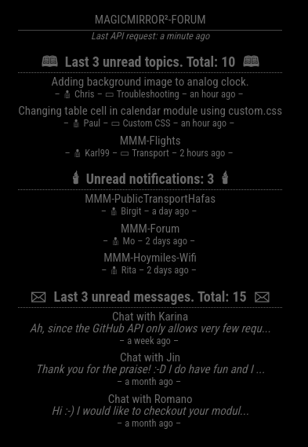

# MMM-Forum

MMM-Forum is a module for [MagicMirror²][mm] that displays information from the MagicMirror² forum, such as unread topics, notifications and messages.

The module should also work for other NodeBB forums, but hasn't been tested yet. Feedback would be appreciated.

## Screenshot



## Installation

### Install

Just clone the module into your modules directory and install the dependencies:

```bash
cd ~/MagicMirror/modules
git clone https://github.com/KristjanESPERANTO/MMM-Forum
npm ci
```

### Update

Just enter the module's directory, pull the update and install the dependencies:

```bash
cd ~/MagicMirror/modules/MMM-Forum
git pull
npm ci
```

## Configuration

### Basic configuration example

To use this module, add it to the modules array in the `config/config.js` file:

```js
    {
        module: "MMM-Forum",
        position: "top_right",
        header: "MagicMirror²-Forum",
        config: {
            username: "your_username",
            password: "your_password"
        }
    },
```

### Configuration options

| Option                   | Type      | Default                                 | Description                                                                                                                 |
| ------------------------ | --------- | --------------------------------------- | --------------------------------------------------------------------------------------------------------------------------- |
| `username`               | `string`  | `""`                                    | **Required**<br>Your username for the forum.                                                                                |
| `password`               | `string`  | `""`                                    | **Required**<br>Your password for the forum.                                                                                |
| `maxUnreadTopics`        | `number`  | `3`                                     | **Optional**<br>Set max entries of the unread topics list set to `0` if you don't want that list.                           |
| `maxUnreadNotifications` | `number`  | `3`                                     | **Optional**<br>Set max entries of the unread notifications list - set to `0` if you don't want that list.                  |
| `maxUnreadMessages`      | `number`  | `3`                                     | **Optional**<br>Set max entries of the unread messages list - set to `0` if you don't want that list.                       |
| `baseUrl`                | `string`  | `"https://forum.magicmirror.builders/"` | **Optional**<br>The base URL of the forum. You may could use another forum, but it is not tested.                           |
| `apiRequestInterval`     | `number`  | `5 * 60 * 1000`                         | **Optional**<br>Interval in milliseconds to request the API. Default is 5 minutes - minimum is 3 minutes (`3 * 60 * 1000`). |
| `displayLastApiCall`     | `boolean` | `true`                                  | **Optional**<br>Display the time of the last API call.                                                                      |

## Contributing

If you find any problems, bugs or have questions, please [open a GitHub issue](https://github.com/KristjanESPERANTO/MMM-Forum/issues) in this repository.

Pull requests are of course also very welcome 🙂

### Developer commands

- `npm run lint` - Run linting and formatter checks.
- `npm run lint:fix` - Fix linting and formatter issues.
- `npm run test` - Run linting and formatter checks + Run spelling check.
- `npm run test:spelling` - Run spelling check.
- `npm run release` - Bump version for release.

## License

This project is licensed under the ISC License - see the [LICENSE](./LICENSE.md) file for details.

## Changelog

All notable changes to this project will be documented in the [CHANGELOG.md](./CHANGELOG.md) file.

## To-Do

- [ ] Add translations.
- [ ] Add tests.
- [ ] Check if there are more interesting API endpoints to use. Like <https://forum.magicmirror.builders/api/config>.
- [ ] Show information about the user.
- [ ] Add GitHub Actions for CI/CD.
- [ ] Add notification sound if there are new notifications.
- [ ] Replace To-Do with GitHub issues.

[mm]: https://github.com/MagicMirrorOrg/MagicMirror
